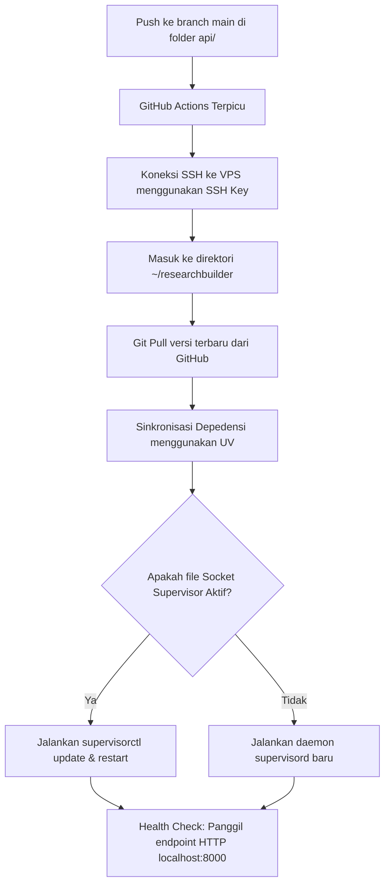

# Panduan Deployment & Manajemen Proses (Supervisor & CI/CD)

Dokumen ini menjelaskan alur integrasi berkelanjutan (CI/CD) menggunakan **GitHub Actions** dan pengelolaan proses aplikasi di VPS menggunakan **Supervisor** dalam mode *user-space* (tanpa akses root/sudo).

---

## 1. Alur Deployment (GitHub Actions)

Alur deployment backend otomatis didefinisikan dalam file [deploy-backend.yml](.github/workflows/deploy-backend.yml).

### Bagaimana Alurnya Bekerja?


### Penjelasan Detail Perintah di Script Deploy:
1. **`git pull origin main`**: Menarik kode terbaru yang baru saja Anda push ke GitHub.
2. **`cd api && uv sync`**: Menggunakan **`uv`** (package manager Python yang sangat cepat) untuk menginstal dan menyelaraskan dependensi sesuai dengan file `pyproject.toml` dan `uv.lock`.
3. **Pendeteksian Socket (`-S "$SUPERVISOR_SOCK"`)**:
   * Jika socket aktif (`.sock` ada), berarti daemon utama Supervisor (`supervisord`) sudah berjalan. Kita tinggal memerintahkan kontroler (`supervisorctl`) untuk melakukan pembaruan.
   * Jika tidak ada, berarti Supervisor mati dan kita perlu menyalakannya kembali dengan perintah `supervisord -c ~/.config/supervisor/supervisord.conf`.

---

## 2. Pengenalan Supervisor (User-Space)

**Supervisor** adalah sistem yang bertugas menjaga aplikasi backend (Uvicorn/FastAPI) Anda agar **selalu hidup** di latar belakang (*background daemon*). Jika aplikasi mengalami crash atau server VPS melakukan restart, Supervisor akan mendeteksi dan menyalakannya kembali secara otomatis.

Karena Anda menggunakan VPS sebagai user biasa (`pharis_ai`) tanpa hak akses `sudo`, Supervisor dikonfigurasi secara lokal:
* **Lokasi Konfigurasi**: `/home/pharis_ai/.config/supervisor/supervisord.conf`
* **Lokasi Log Aplikasi**: `/home/pharis_ai/researchbuilder/uvicorn.log`

---

## 3. Perintah Penting `supervisorctl`

Untuk mengelola backend di VPS, Anda menggunakan utilitas `supervisorctl` dengan menyertakan file konfigurasi lokal Anda:

### A. Melihat Status Proses
Untuk melihat apakah aplikasi backend (`researchbuilder`) sedang berjalan, berapa lama waktu aktifnya, atau apakah ada error:
```bash
supervisorctl -c ~/.config/supervisor/supervisord.conf status
```

### B. Menerapkan Perubahan Konfigurasi (PENTING)
Jika Anda mengubah isi file `supervisord.conf` (misalnya menambahkan `environment` baru seperti `OPENALEX_API_KEY` atau `GROQ_API_KEY`):
```bash
supervisorctl -c ~/.config/supervisor/supervisord.conf update
```
> [!IMPORTANT]
> Perintah `restart` biasa **TIDAK AKAN** membaca ulang file konfigurasi dari disk. Anda **wajib** menjalankan `update` agar Supervisor memuat variabel lingkungan baru ke memori sebelum me-restart aplikasinya.

### C. Me-restart Aplikasi
Jika Anda hanya ingin me-restart aplikasi (misal setelah mengubah file `.env` proyek tanpa mengubah konfigurasi Supervisor):
```bash
supervisorctl -c ~/.config/supervisor/supervisord.conf restart researchbuilder
```

### E. Memantau Log secara Real-time (*Tail Logs*)
Untuk melihat keluaran *stdout* atau error dari backend Anda secara langsung saat aplikasi berjalan:
```bash
supervisorctl -c ~/.config/supervisor/supervisord.conf tail -f researchbuilder
```
*(Tekan `Ctrl + C` untuk keluar dari mode pemantauan log).*

---

## 4. Cara Menambah Variabel Lingkungan Baru di VPS

Jika Anda ingin menambahkan konfigurasi API Key baru di kemudian hari:

1. Buka konfigurasi menggunakan editor teks di VPS:
   ```bash
   nano ~/.config/supervisor/supervisord.conf
   ```
2. Temukan bagian `environment=` dan tambahkan variabel Anda dengan pemisah koma:
   ```ini
   environment=ENVIRONMENT="production",...,KEY_BARU="nilai_key"
   ```
3. Simpan dan keluar (di nano: `Ctrl + O` -> `Enter` -> `Ctrl + X`).
4. Jalankan perintah pembaruan agar dibaca oleh Supervisor:
   ```bash
   supervisorctl -c ~/.config/supervisor/supervisord.conf update
   ```
